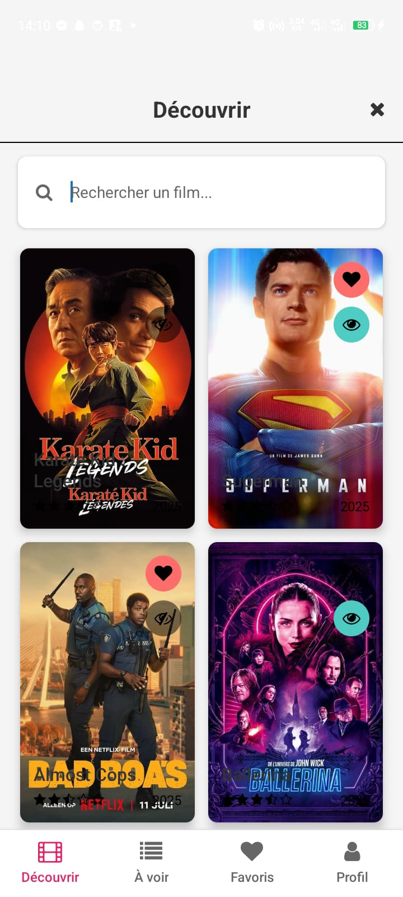
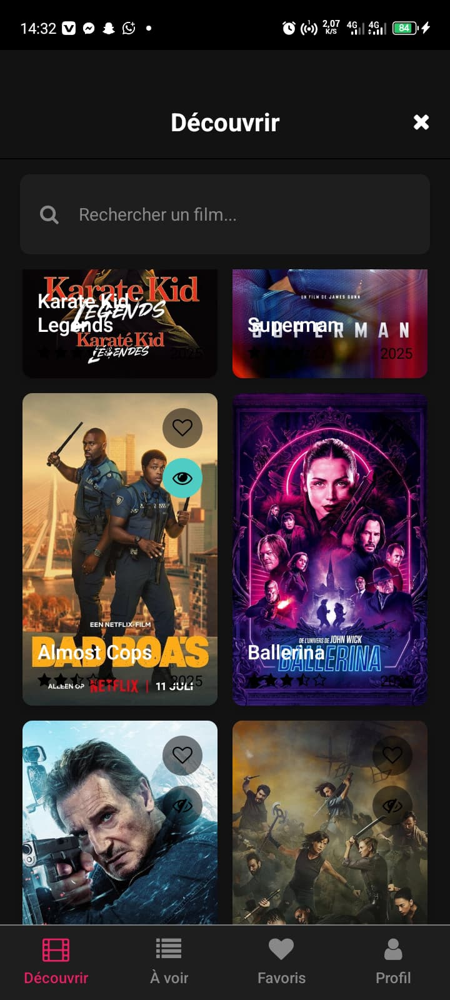
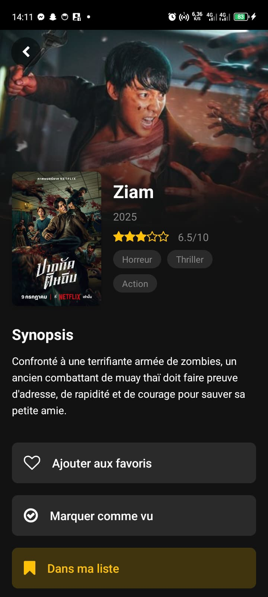
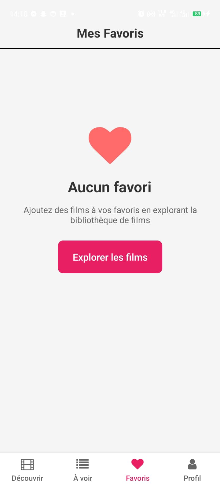
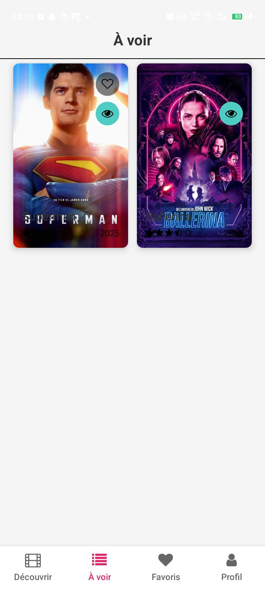
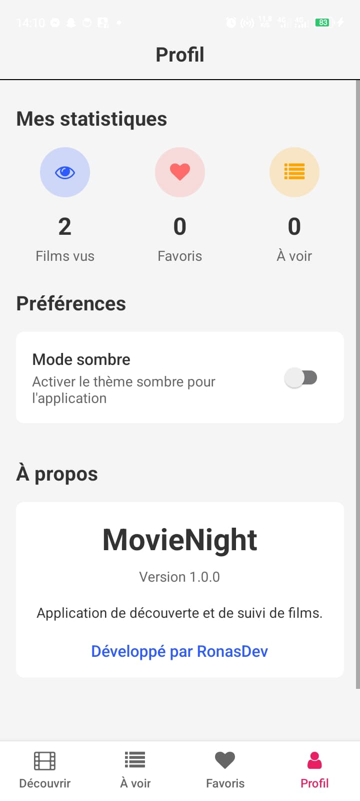
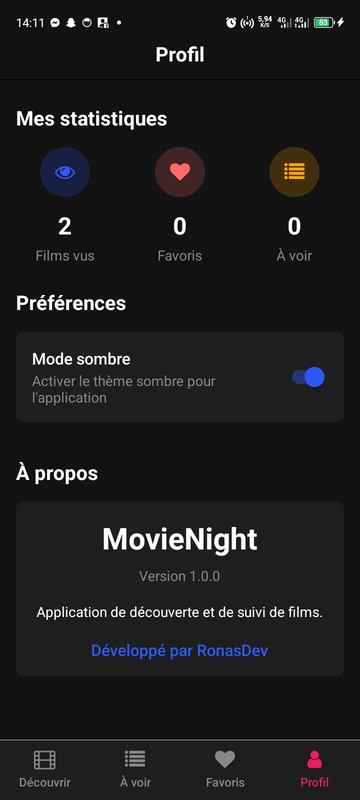

# MovieNight


## 📱 Présentation

**MovieNight** est une application mobile moderne développée avec React Native et Expo qui permet aux utilisateurs de suivre leurs films préférés, ceux qu'ils ont vus et ceux qu'ils souhaitent voir. L'application offre une interface utilisateur élégante et intuitive avec un thème sombre par défaut.

Cette application a été créée pour la chaîne YouTube [RonasDev](https://www.youtube.com/ronasdev) comme exemple d'application React Native mettant en valeur AsyncStorage et Stack Navigation.

## ✨ Fonctionnalités

- **Découverte de films** - Parcourez une sélection de films populaires
- **Liste de films à voir** - Gardez une trace des films que vous voulez regarder
- **Favoris** - Marquez vos films préférés
- **Films vus** - Suivez les films que vous avez déjà regardés
- **Détails des films** - Consultez des informations détaillées sur chaque film
- **Thème sombre** - Interface utilisateur moderne et agréable pour les yeux
- **Données persistantes** - Vos listes sont sauvegardées entre les sessions

## 🛠️ Technologies utilisées

- [React Native](https://reactnative.dev/) - Framework pour applications mobiles
- [Expo](https://expo.dev/) - Plateforme pour développer des applications React Native
- [React Navigation](https://reactnavigation.org/) - Navigation entre écrans
  - Stack Navigation pour les écrans détaillés
  - Tab Navigation pour les sections principales
- [AsyncStorage](https://react-native-async-storage.github.io/async-storage/) - Stockage de données persistant
- [Expo Linear Gradient](https://docs.expo.dev/versions/latest/sdk/linear-gradient/) - Effets visuels avancés
- [React Native Vector Icons](https://github.com/oblador/react-native-vector-icons) - Icônes pour l'interface utilisateur

## 📋 Prérequis

- [Node.js](https://nodejs.org/) (v14 ou supérieur)
- [npm](https://www.npmjs.com/) ou [yarn](https://yarnpkg.com/)
- [Expo CLI](https://docs.expo.dev/workflow/expo-cli/)
- Un appareil mobile ou un émulateur

## 🚀 Installation

1. Clonez ce dépôt :
```bash
git clone https://github.com/votre-username/MovieNight.git
cd MovieNight
```

2. Installez les dépendances :
```bash
npm install
# ou
yarn install
```

3. Démarrez l'application :
```bash
expo start
# ou
npm start
# ou
yarn start
```

4. Scannez le code QR avec l'application Expo Go (Android) ou l'appareil photo (iOS) ou utilisez un émulateur.

## 📂 Structure du projet

```
MovieNight/
├── assets/                 # Ressources statiques (images, icônes)
├── src/
│   ├── components/         # Composants réutilisables
│   ├── screens/            # Écrans de l'application
│   ├── navigation/         # Configuration de la navigation
│   ├── services/           # Services (AsyncStorage, API)
│   ├── hooks/              # Hooks personnalisés
│   └── utils/              # Utilitaires et constantes
├── App.js                  # Point d'entrée principal
└── package.json            # Configuration des dépendances
```

## 📱 Écrans principaux

- **HomeScreen** - Découverte de films
- **WatchlistScreen** - Liste de films à voir
- **FavoritesScreen** - Films marqués comme favoris
- **ProfileScreen** - Statistiques utilisateur et préférences
- **MovieDetailScreen** - Détails d'un film spécifique

## 🧠 Points forts d'implémentation

### AsyncStorage
L'application utilise AsyncStorage pour stocker localement les préférences utilisateur et les listes de films. Un hook personnalisé `useAsyncStorage` a été créé pour faciliter l'utilisation d'AsyncStorage dans les composants React.

```javascript
// Exemple d'utilisation du hook useAsyncStorage
const [favorites, setFavorites, loading, error, refreshData] = 
  useAsyncStorage(STORAGE_KEYS.FAVORITE_MOVIES, []);
```

### Navigation
MovieNight utilise React Navigation avec une combinaison de navigation par onglets pour les sections principales et navigation par pile pour les écrans de détails.

```javascript
// Exemple de navigation vers l'écran détaillé d'un film
navigation.navigate('MovieDetail', { movie });
```

# 🎬 MovieNight

**Votre compagnon ultime pour suivre, découvrir et gérer vos films préférés.**

MovieNight est une application mobile moderne et élégante, développée avec React Native et Expo, conçue pour les cinéphiles. Elle permet de découvrir les films populaires, de rechercher des titres spécifiques, et de gérer des listes personnelles de favoris et de films "à voir".

---

## 📸 Captures d'écran

*Insérez ici vos captures d'écran. Vous pouvez les glisser-déposer dans GitHub ou utiliser des balises ``.*

| Écran d'accueil (Thème Clair) | Écran d'accueil (Thème Sombre) |
| :---: | :---: |
|  |  |

| Détails du Film | Favoris |
| :---: | :---: |
|  |  |

| Liste des Films a voir vide | Liste des Films à Voir |
| :---: | :---: |
|  |  |

| Profil | Profil: Theme sombre|
| :---: | :---: |
|  |  |

---

## ✨ Fonctionnalités

- **Thème Dynamique :** Basculez instantanément entre un thème clair et un thème sombre.
- **Découverte de Films :** Explorez les films les plus populaires du moment.
- **Recherche Avancée :** Trouvez n'importe quel film grâce à la recherche intégrée.
- **Détails Complets :** Accédez aux informations détaillées de chaque film (synopsis, note, genres, etc.).
- **Gestion des Favoris :** Ajoutez ou retirez des films de votre liste de favoris personnelle.
- **Liste "À Voir" (Watchlist) :** Gardez une trace des films que vous prévoyez de regarder.
- **Persistance des Données :** Vos listes sont sauvegardées localement sur votre appareil grâce à `AsyncStorage`.
- **Interface Moderne :** Une interface utilisateur propre, réactive et agréable.

---

## 🛠️ Technologies utilisées

- **React Native** - Framework principal pour le développement mobile.
- **Expo** - Plateforme pour faciliter le développement et le déploiement.
- **React Navigation** - Pour la gestion de la navigation entre les écrans.
- **AsyncStorage** - Pour le stockage local des données utilisateur.
- **Axios** - Pour effectuer les requêtes à l'API TMDB.
- **The Movie Database (TMDB) API** - Pour fournir les données sur les films.

---

## 🚀 Démarrage Rapide

Suivez ces étapes pour lancer le projet sur votre machine locale.

### Prérequis

- [Node.js](https://nodejs.org/) (version 16 ou supérieure)
- [npm](https://www.npmjs.com/) ou [yarn](https://yarnpkg.com/)
- [Expo CLI](https://docs.expo.dev/get-started/installation/)

### Installation

1.  **Clonez le dépôt :**
    ```bash
    git clone https://github.com/VOTRE_NOM_UTILISATEUR/MovieNight.git
    cd MovieNight
    ```

2.  **Installez les dépendances :**
    ```bash
    npm install
    # ou
    yarn install
    ```

3.  **Configurez votre clé d'API TMDB :**
    - Créez un compte sur [TMDB](https://www.themoviedb.org/signup) et obtenez une clé d'API.
    - Créez un fichier `.env` à la racine du projet.
    - Ajoutez votre clé d'API dans ce fichier :
      ```
      TMDB_API_KEY=VOTRE_CLÉ_API_ICI
      ```
    - Assurez-vous que le fichier `src/services/api.js` est configuré pour lire cette variable d'environnement.

4.  **Lancez l'application :**
    ```bash
    npx expo start
    ```
    Scannez le QR code avec l'application Expo Go sur votre téléphone (iOS ou Android).

---

## 📂 Structure du projet

Le projet est organisé de manière modulaire pour faciliter la maintenance et l'évolution :

```
MovieNight/
├── src/
│   ├── assets/         # Polices et images statiques
│   ├── components/     # Composants réutilisables (MovieCard, Header...)
│   ├── contexts/       # Contextes React (ThemeContext)
│   ├── hooks/          # Hooks personnalisés (useAsyncStorage)
│   ├── navigation/     # Configuration de la navigation
│   ├── screens/        # Écrans de l'application (HomeScreen, MovieDetailScreen...)
│   ├── services/       # Services (api.js, storageService.js)
│   └── utils/          # Utilitaires (theme.js, constants...)
├── .env                # Fichier pour les variables d'environnement (non versionné)
├── App.js              # Point d'entrée de l'application
└── package.json        # Dépendances et scripts
```

---

## 🤝 Contribution

Les contributions sont les bienvenues ! Si vous avez des idées d'amélioration ou des corrections de bugs, n'hésitez pas à ouvrir une *issue* ou une *pull request*.

---

## 📄 Licence

Ce projet est sous licence MIT. Voir le fichier `LICENSE` pour plus de détails.

---

## 📞 Contact

**RonasDev** - [YouTube](https://www.youtube.com/ronasdev) - [GitHub](https://github.com/ronasdev)

Un projet réalisé avec ❤️ pour la communauté des développeurs.
- [Documentation React Native](https://reactnative.dev/docs/getting-started)
- [Documentation Expo](https://docs.expo.dev/)
- [Documentation React Navigation](https://reactnavigation.org/docs/getting-started)

## 📄 Licence

Ce projet est sous licence MIT.

---

⭐️ **Créé par [RonasDev](https://www.youtube.com/ronasdev)** ⭐️
